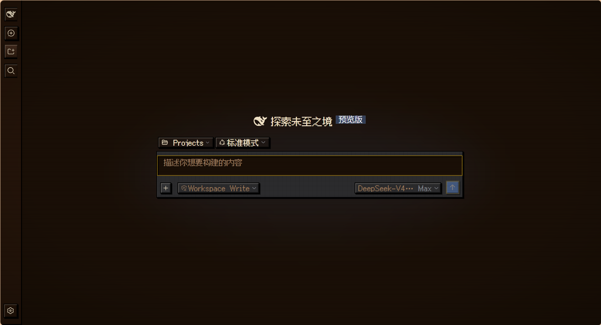
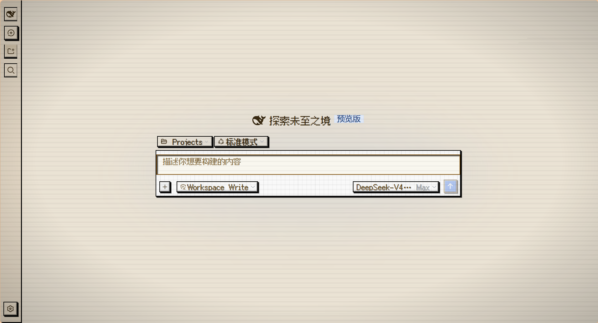
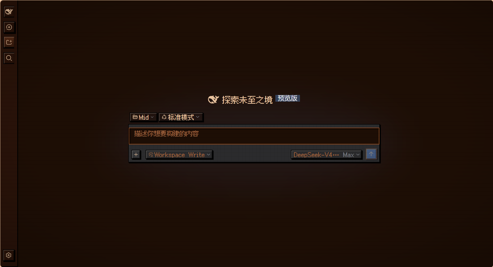
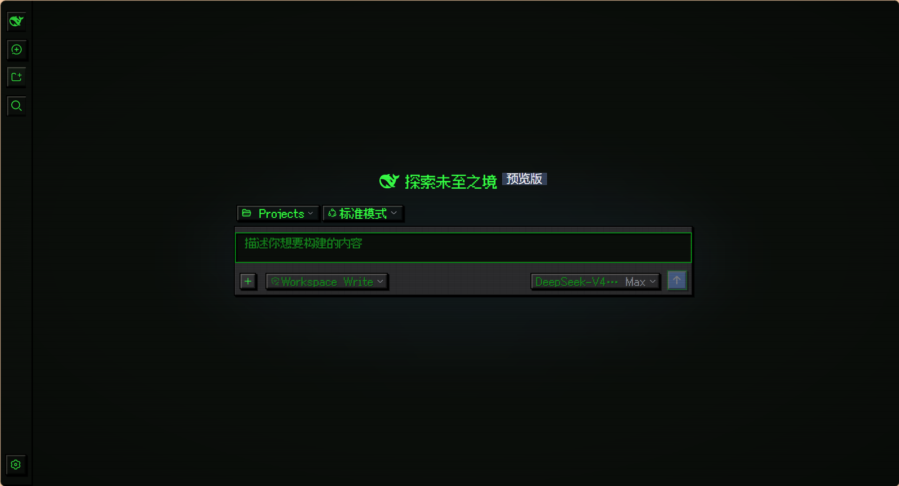
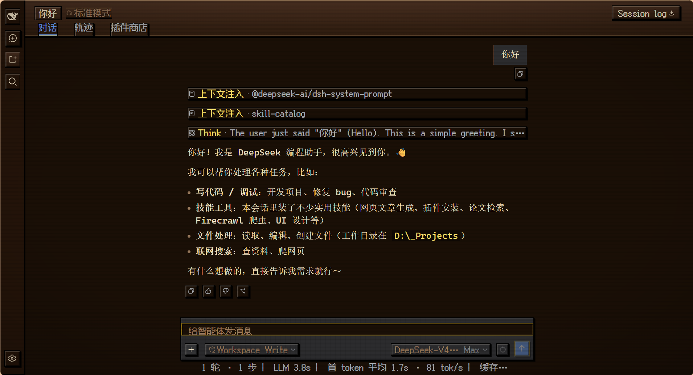

# dsh-pixel-ui

> DeepSeek Harness 像素皮肤（Agent Xi 风格）：四个主题一键切换——像素·木屋 / 像素·羊皮纸 / 像素·暖阳 / 像素·终端绿，随时可切回现代默认 UI。

## Screenshots

| 像素·木屋 | 像素·羊皮纸 | 像素·暖阳 | 像素·终端绿 |
| --- | --- | --- | --- |
|  |  |  |  |

对话页与输入框（木屋）：



## Overview

`dsh-pixel-ui` 把 Web GUI 重皮肤成像素 RPG 风：

- **四主题**：木屋（深木色 + 金色）、羊皮纸（亮色纸面）、暖阳（暖橙木色）、终端绿（经典 CRT 绿字）
- **像素字体**：标题/页签/按钮/徽章/输入框用 fusion-pixel（中文）+ Press Start 2P（英文/数字），正文与代码走 mono
- **质感**：阶梯硬阴影、8-bit 凸起按钮（悬停抬升、按下沉底）、内凹输入框、木纹条纹、CRT 扫描线 + 暗角、像素光标
- **开关**：设置 → 通用 → **像素主题** 行切换五个选项；选「现代默认」即整体退出皮肤，且选择会被记住

安装后首次加载自动激活「像素·木屋」。切换任意主题（含现代默认/浅色/深色）后，下次打开会恢复你最后的选择。

## Themes

| 主题 id | 名称 | 模式 | 主色 |
| --- | --- | --- | --- |
| `pixel-wood` | 像素·木屋 | 深色 | 深木 `#1A0F06` + 金 `#F4D03F` |
| `pixel-paper` | 像素·羊皮纸 | 浅色 | 纸面 `#F0E8D8` + 金棕 `#C8960C` |
| `pixel-warm` | 像素·暖阳 | 深色 | 暖木 `#1E0E04` + 橙 `#FF8C42` |
| `pixel-retro` | 像素·终端绿 | 深色 | 墨绿 `#0A0E0A` + 绿 `#33FF33` |

## Compatibility

| 项 | 支持范围 |
| --- | --- |
| dsh 生态 | `0.1.0-rc.6`（ThemeService `register`/`setTheme` seam + `settings.general.item` 槽位） |
| 模式 | 三深色 + 一浅色（`colorScheme` 按主题声明） |
| 字体 | fusion-pixel 12px zh_hans（MIT）+ Press Start 2P（OFL），随包分发 |

## Install

```bash
dsh plugin --profile web add dsh-pixel-ui     # npm 发布后
# 本地开发：profile package.json 加 "dependencies": { "dsh-pixel-ui": "link:<本仓库>" }
#            + dsh.profile.bundles 加 "dsh-pixel-ui"，然后 pnpm install
```

## Uninstall

从 profile `package.json` 移除依赖与 bundles 条目，`pnpm install`。

## Configuration

无配置项。四个主题的 13 个 `--dsw-alias-*` token 定义在 `src/client/index.js` 的 `THEMES`；像素质感样式在 `src/client/pixel.css`（`html[data-pixel-ui]` 作用域 + `html[data-pixel-theme='…']` 四套色板）。最后一次选择存于浏览器 `localStorage`（`dsh-pixel-ui:theme`）。

## Permissions & data

- 宿主半边只读本包内字体文件，仅注册一个 `/dsh-pixel-ui/fonts/*` 路由（文件名白名单）
- 浏览器半边注册主题 + 注入样式表 + 一个设置行，无网络请求、无遥测；只在 `localStorage` 存一个主题 id

## Troubleshooting

| 现象 | 处理 |
| --- | --- |
| 皮肤没生效 | `dsh --profile web --dump-config` 确认 `dsh-pixel-ui` 在树；设置 → 通用 → 像素主题 里选一个主题；重启 |
| 想回现代默认 | 设置 → 通用 → 像素主题 → 点「现代默认」（或外观行选 浅色/深色/跟随系统）；卸载走上面的步骤 |
| 字体没加载 | 浏览器控制台看 `/dsh-pixel-ui/fonts/*` 是否 200 |
| 主题没记住 | 确认浏览器未禁用 `localStorage` |

## Development

```bash
npm install
npm run build      # 构建 lib/client.js（wire 格式，CSS 以文本内联）
```

## License & security

[MIT](./LICENSE) · 字体：fusion-pixel（MIT）、Press Start 2P（SIL OFL）。

安全问题请通过 GitHub security advisory 私下报告。
