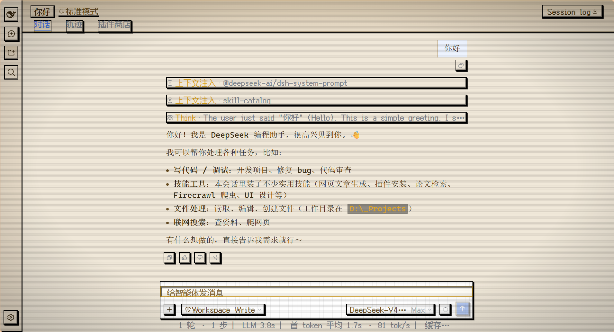
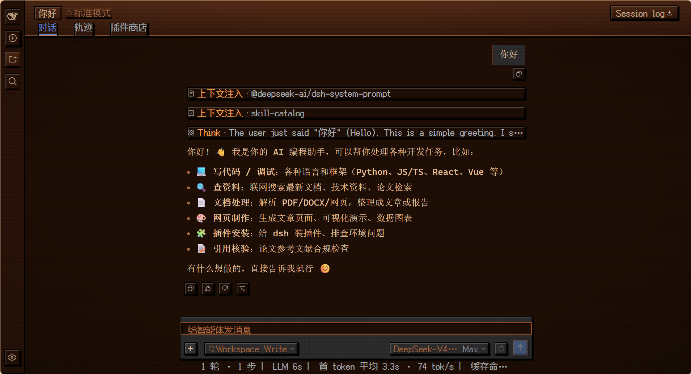
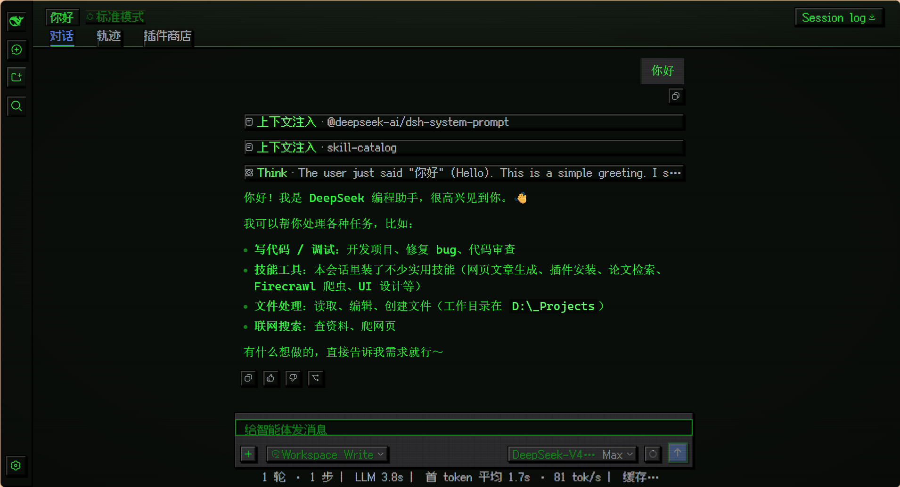

<div align="center">

# 🪵 dsh-pixel-ui

**DeepSeek Harness 像素皮肤（Agent Xi 风格）**

四个主题一键切换 · 像素字体 · CRT 质感 · 随时回到现代默认 UI


</div>

## ✨ 特性

- 🎨 **四套配色**：深木 + 金、纸面 + 金棕、暖橙木、CRT 绿字——色板与 Agent Xi 主题系统同源
- 👾 **像素字体**：标题/页签/按钮/徽章/输入框用 fusion-pixel（中文）+ Press Start 2P（英文数字），正文与代码走 mono，长文不累眼
- 🕹️ **8-bit 质感**：阶梯硬阴影、凸起按钮（悬停抬升、按下沉底）、内凹输入框、木纹条纹、CRT 扫描线 + 暗角、像素光标
- ⚡ **开箱即穿**：首次安装自动激活默认主题，之后记住你的选择，不再强行上身

## 🎨 四个主题

### 像素·木屋 · `pixel-wood`

> 深色 · 深木 `#1A0F06` + 金 `#F4D03F`（默认主题）


### 像素·羊皮纸 · `pixel-paper`

> 浅色 · 纸面 `#F0E8D8` + 金棕 `#C8960C`


### 像素·暖阳 · `pixel-warm`

> 深色 · 暖木 `#1E0E04` + 橙 `#FF8C42`


### 像素·终端绿 · `pixel-retro`

> 深色 · 墨绿 `#0A0E0A` + 绿 `#33FF33`


<details>
<summary>📷 对话页与输入框（展开查看四主题截图）</summary>






</details>

## 🚀 安装

```bash
dsh plugin --profile web add dsh-pixel-ui   # npm 发布后
```

本地开发：

```bash
# 1. profile package.json 的 dependencies 加： "dsh-pixel-ui": "link:<本仓库路径>"
# 2. dsh.profile.bundles 加 "dsh-pixel-ui"
# 3. pnpm install
```

## 🧭 使用

1. **切换主题**：设置 → 通用 → **像素主题**，五个按钮一键切换
2. **回到现代默认**：点「现代默认」（或在外观行选 浅色 / 深色 / 跟随系统），皮肤整体退场；现代模式下「像素主题」行依然在，随时可换回来
3. **记住选择**：最后的选择存在浏览器 `localStorage`（`dsh-pixel-ui:theme`），下次打开自动恢复

## 🕹️ 设计语言

| 技法 | 说明 |
| --- | --- |
| 阶梯硬阴影 | `2px 2px 0 #000` 三层硬投影 + 内凹/凸起 bevel，模拟像素厚度 |
| 木纹纹理 | 面板/卡片每 10px 一条 1px 暗竖纹 |
| CRT 滤镜 | 顶层扫描线 + 暗角 + `steps(60)` 微闪烁，尊重系统「减少动态效果」偏好 |
| 像素光标 | SVG 阶梯箭头（默认奶油色 / 可点元素金色 / 输入框 I 形） |
| 禁抗锯齿 | `-webkit-font-smoothing: none` + `geometricPrecision`，保住像素字锐边 |
| 方形化 | 全局 `border-radius: 0`，徽章用 clip-path 切 2px 像素角 |
| 按压动效 | 悬停抬升 2px 阴影加厚，按下沉底 2px 阴影压平 |

浅色主题（羊皮纸）会自动收敛文字硬阴影，避免浅底上出现重影。

## 🧩 兼容性

| 项 | 支持范围 |
| --- | --- |
| dsh 生态 | `0.1.0-rc.6`（ThemeService `register`/`setTheme` + `settings.general.item` 槽位） |
| 模式 | 三深色 + 一浅色（`colorScheme` 按主题声明） |
| 字体 | fusion-pixel 12px zh_hans（MIT）+ Press Start 2P（OFL），随包分发 |

## 🔧 配置说明

无配置项。四个主题的 13 个 `--dsw-alias-*` token 定义在 `src/client/index.js` 的 `THEMES`；像素质感样式在 `src/client/pixel.css`（`html[data-pixel-ui]` 作用域 + `html[data-pixel-theme='…']` 四套色板）。

## 🔒 权限与数据

- 宿主半边只读本包内字体文件，仅注册一个 `/dsh-pixel-ui/fonts/*` 路由（文件名白名单）
- 浏览器半边注册主题 + 注入样式表 + 一个设置行；无网络请求、无遥测，只在 `localStorage` 存一个主题 id

## 🩺 疑难排查

| 现象 | 处理 |
| --- | --- |
| 皮肤没生效 | `dsh --profile web --dump-config` 确认 `dsh-pixel-ui` 在树；设置 → 通用 → 像素主题 里选一个主题；重启 |
| 想回现代默认 | 设置 → 通用 → 像素主题 → 点「现代默认」（或外观行选 浅色/深色/跟随系统） |
| 字体没加载 | 浏览器控制台看 `/dsh-pixel-ui/fonts/*` 是否 200 |
| 主题没记住 | 确认浏览器未禁用 `localStorage` |

## 🧑‍💻 开发

```bash
npm install
npm run build   # 构建 lib/client.js（wire 格式，CSS 以文本内联）
```

## 📜 许可证与安全

[MIT](./LICENSE) · 字体：fusion-pixel（MIT）、Press Start 2P（SIL OFL）。

安全问题请通过 GitHub security advisory 私下报告。
