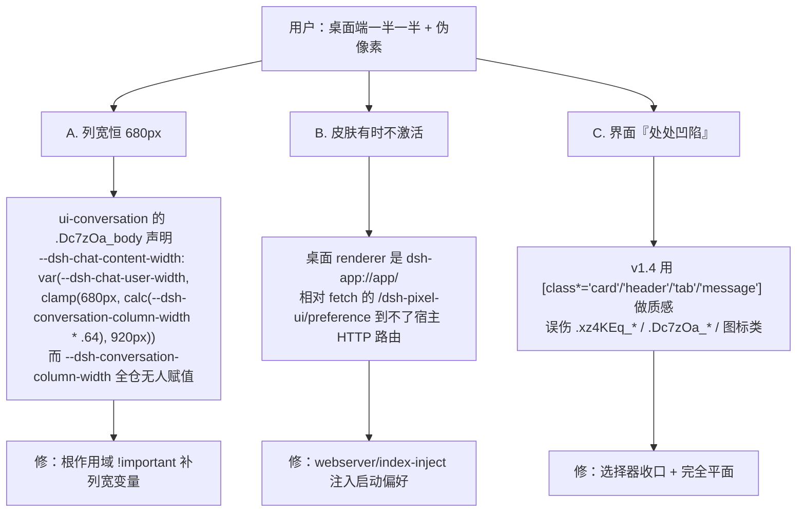
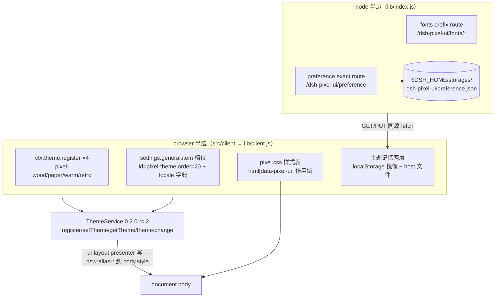

# 开发计划 · v1.5.0（桌面端布局修正 + 去伪像素 + 完全平面）

> 状态：**已完成**（2026-10-01）。验收见文末。

## 1. 背景与目标

用户诉求（原话）：
1. 「在桌面端会出现这种一半一半的情况，修一下；同时整体优化，改善那种伪像素
   （比如任务那一长条，内部一大堆线），使其趋近于真实像素质感」
2. 「不要加立体效果了，我感觉这样就不错，能不能实现」

拆成四件事：

| # | 目标 | 判定标准 |
| --- | --- | --- |
| A | 修桌面端「一半一半」：正文不再恒定 680px | 宽窗口下 `--dsh-chat-content-width` 随视口变大（探针实测 ≥840px @1536 视口） |
| B | 皮肤在桌面端每次都真的激活 | `dsh-app://app` origin 下刷新后 `data-pixel-ui` 有值，不依赖 HTTP 路由 |
| C | 去伪像素 | 全表 0 个 `box-shadow`/`text-shadow`/`blur()`；无 1px 装饰细线；无无前缀 `[class*=...]` |
| D | 测试与文档 | host/client/contrast 三套全绿；踩坑 #6/#7/#8 成文 |

## 2. 根因（三条，均源码级或实测）

## 3. 关键设计决策（为什么）

1. **列宽修在皮肤里，而不是改宿主**：`--dsh-chat-content-width` 的 clamp 下限是宿主
   刻意给窄屏留的设计值，皮肤只在**宽屏**把它撑开（`clamp(680px, 64vw - 140px, 1200px)`），
   1281px 视口下算出来仍是 680px —— 不改变宿主的窄屏观感。
2. **用 `!important` 声明自定义属性**：宿主会把 `--dsh-chat-user-width` 以内联样式写在
   容器上；自定义属性参与级联，`!important` 是唯一能压过内联的手段。已用
   `TEMP/cssvar.html`（headless Edge 截图）验证过这条级联行为。
3. **偏好走 index 注入而不是加绝对 URL**：桌面端 renderer 不知道宿主 HTTP 端口
   （`location.origin` 是 `dsh-app://app`），注入是两条部署（desktop / web）都存在的
   通道，而且**在首屏前就绪**，顺带消掉闪现代皮的一帧。
4. **完全平面**：见踩坑 #6。用户明确要平面，因此把「层次」从阴影改成
   描边 + 明度差 + 2px 抖动 + 手绘 SVG；同时立一条测试门禁，防止以后又长回阴影。
5. **`restoring` 标志提前放掉**：皮肤恢复是异步的（要读偏好），而宿主的初始
   preference 会在同一窗口到达；标志必须绑定「皮肤已应用」而不是「读取已完成」。

## 4. 验收标准（全部达成）

- [x] `node scripts/test-host.mjs` → 20 checks passed（含 index 注入表 + dispose 释放）
- [x] `node scripts/test-client.mjs` → 26 checks passed（含桌面注入通道、迟到内置偏好、平面/选择器门禁）
- [x] `node scripts/audit-contrast.mjs` → ALL PASS
- [x] `npm run build` 成功，`lib/client.js` 与源码一致（无探针残留）
- [x] 桌面端探针实测：`col=843 | scroll=1241 | vw=1536`（修复前 `col=680`）
- [x] 桌面端截图确认：平面、无毛边、页签金下沿、皮肤随刷新稳定激活

## 5. 未验证 / 下一步

- Web 部署下「HTTP 路由兜底」这条路径只有 fake fetch 覆盖，等有条件时在真实浏览器确认。
- 宿主自身的 `dsh-app://app/api/*` 404 与本插件无关（用户在另一会话跟进）。

---

# 开发计划 · v1.4.0（DSH 0.2.x 适配 + UI/UX 重构）

> 状态：**已完成**（2026-10-01）。验收见文末。

## 1. 背景与目标

用户诉求（原话）：「对该项目做最新的版本适配，尤其是桌面端；同时进行优化，结合 ui/ux 进行界面重构优化」。

本机运行时事实（2026-10-01 实测）：
- DSH Desktop 运行中进程：`D:\_Downloads\Installers\dsh\DeepSeek Harness.exe --expose-internals ...profiles\desktop`，`runtime.json` 的 `desktopVersion = 0.2.0-rc.2`，profile 以 `link:` 方式指向本仓库。
- 客户端契约包（app.asar 内）全部为 `0.2.0-rc.2`：`dsh-client-ui-theme` / `-ui-slots` / `-ui-settings-general` / `-client-store` / `-client-ui-primitives` / `dsh-app-boot` / `dsh-host-webserver`。
- v1.3.0 的 peer 范围只到 `<0.2.0-0`，本地改过 peer 才进树；09-28 的结论是「加载了但证不了渲染结果」。

拆解成四件事：

| # | 目标 | 判定标准 |
| --- | --- | --- |
| A | 版本适配：契约逐条核对 + peer 范围按 app-boot 语义覆盖 0.1.x~0.2.x | 契约有源码级差异清单；`semver.satisfies(runtime, range, {includePrerelease:true})` 对全部目标运行时为 true |
| B | 桌面端：主题记忆不再依赖 origin | 新增宿主侧偏好文件（`$DSH_HOME/storages/dsh-pixel-ui/preference.json`），随机端口重启后皮肤不丢 |
| C | UI/UX 重构：设置行 + 全局质感 | 对比度审计脚本全绿（文本 ≥4.5:1 / 非文本 ≥3:1）；设置行 aria-pressed、焦点环、触摸目标 ≥24px、helper text、locale 字典 |
| D | 测试与文档 | host/client/contrast 三套 node 测试全绿；docs/dev 建目录 |

## 2. 架构（v1.4.0）

关键设计决策（为什么这样做）：

1. **peer 范围不用 `workspace:*`**：app-boot 的 `evaluatePluginCompatibility` 只认 `peerDependencies` 里 `@deepseek-ai/dsh` / `@deepseek-ai/dsh-*` 的范围（`semver.satisfies(运行时, 范围, {includePrerelease:true})`）。`workspace:*` 虽被支持，但写成显式多段范围与 cost-meter 1.7.49 生态惯例一致、可读性更好。范围同时覆盖 `0.1.0-rc.6~0.1.7-rc.2` 与 `0.2.0-rc.1~0.2.x`（已用 semver 实测 5 个运行时全过）。
2. **`dsh.compatibility.dshReleases` 仍然写**：app-boot 不读它（源码无匹配分支），但它是 dshmarket/仓库的声明式惯例，向下游说明「哪些版本实测过」。
3. **偏好持久化放宿主文件，不做成设置 schema**：`ThemeRuntime.setTheme` 只把内置偏好（light/dark/system）写进宿主 settings scope，第三方主题 id 写不进去（`isThemePreference` 门槛）。所以自建 `$DSH_HOME/storages` 文件 + 同源路由，浏览器侧 localStorage 做每 origin 镜像。旧宿主（无此路由）GET 返回 404 → 客户端降级为纯 localStorage，行为与 v1.3.0 一致。
4. **恢复顺序先本地后宿主**：本地镜像同步生效避免闪烁；本地缺失（新端口）才等一次 GET；两侧都有且不一致时以宿主为准（宿主是「最后一次选择」的权威）。

## 3. UI/UX 重构要点（依据 ui-ux-pro-max 检索结论）

检索过的规则（scripts/search.py，domain=ux）：对比度 4.5:1 / 非文本 3:1；web 目标 ≥24 CSS px（WCAG 2.2）；焦点环必须可见且不遮挡；reduced-motion 必查。

| 项 | v1.3.0 | v1.4.0 |
| --- | --- | --- |
| 对比度 | 14 处不达标（浅色主题金色系 1.2~2.2:1） | 审计脚本门禁，全绿；金色系按明/暗主题拆成对变量 |
| 设置行配色 | 硬编码 hex（现代模式下不可读） | `var(--px-x, var(--dsw-alias-y))` 双层回落 |
| 选中态 | 木屋金底 + 硬编码深字 | `--px-accent-bg/--px-accent-ink` 每主题成对 |
| 无障碍 | 无 aria-pressed | role=group + aria-pressed + swatch aria-hidden |
| 触摸目标 | ~26px | min-height 32px（≥24px 门槛之上） |
| 焦点 | 依赖全局 !important | 行内 :focus-visible 焦点环 + token 回落 |
| i18n | 无 | `settings.pixel-ui` locale 字典（zh/en 键集对齐） |
| helper text | 无 | desc 行说明即时生效/跨重启/现代默认语义 |

## 4. 验收标准（全部达成）

- [x] `node scripts/test-host.mjs` → 17 checks passed（字体白名单/遍历 404/preference 读写与校验/ dispose）
- [x] `node scripts/test-client.mjs` → 21 checks passed（wire 格式/注册/恢复矩阵/交互/渲染/dispose）
- [x] `node scripts/audit-contrast.mjs` → ALL PASS（exit 0）
- [x] `npm run build` 成功，`lib/client.js` 与源码一致
- [x] 宿主 fonts 路由实测 200（woff2/ttf，content-type 正确；白名单外与路径穿越均 404）
